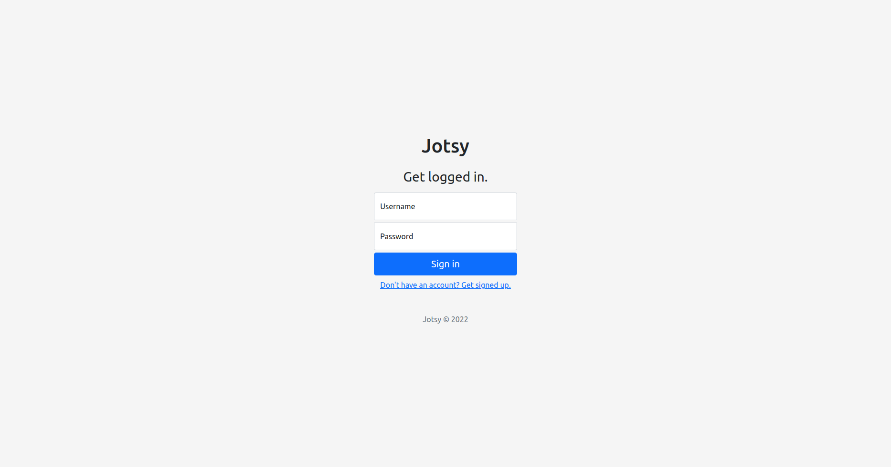

#  Jotsy: Just your notes

Jotsy is a self-hosted, free and open-source note taking app with a goal of simplicity in mind. It is powered by [Skytable](https://github.com/skytable/skytable). Read the [full blog post here](https://ohsayan.github.io/2022/02/jotsy-a-self-hosted-notes-app).

| App                         | Login page                    | Signup page                    |
| --------------------------- | ----------------------------- | ------------------------------ |
|  |  |  |

> 🚧 This is currently under development

## Features

- 🏢 Multi-user
- ✍️ Effective and distraction free notemaking
- 🖋 Plaintext or markdown
- 🔐 Secure authentication and session management
- 🌱 Extremely simple to self-host
- 🌲 Extremely light on resources
- 🍃 Extremely lightweight on the browser
- ⚒️ Simple configuration (read [more here](./CONFIG.md))

## Getting started

1. First, install `docker-compose` by following the instructions [here](https://docs.docker.com/compose/install/)
2. Run this:
   ```sh
   mkdir jotsy && cd jotsy && wget https://raw.githubusercontent.com/ohsayan/jotsy/next/docker-compose.yml && sudo docker-compose up -d
   ```
3. Open your browser and head to http://localhost:2022

## Updating to the latest release

To update to the latest release (don't worry, you won't lose any data), run this:

```sh
cd jotsy && sudo docker pull ohsayan/jotsy:latest && sudo docker-compose up -d
```

This will pull the latest Jotsy image, stop the existing instance, rebuild the container and start it up again.

## Stack

- Backend:
  - Database: [Skytable](https://github.com/skytable/skytable)
  - Language: [Rust](https://rust-lang.org)
  - Framework/tools:
    - [Tokio](https://tokio.rs): Asynchronous runtime
    - [Axum](https://github.com/tokio-rs/axum): A web framework built on top of Tokio
- Frontend:
  - CSS Framework: [Bootstrap](https://getbootstrap.com/)
  - Scripting: Pure JavaScript (uses AJAX)
  - Markup: Pure HTML

## Contributing

As highlighted in the original blog post, please create issues for any ideas you have; I want to hear them! Want to collaborate (would love some frontend wizard for some help :P)? Shoot me a [DM on Twitter](https://twitter.com/ohhsayan).

## License

This app is distributed under the [Apache-2.0 License](./LICENSE).
